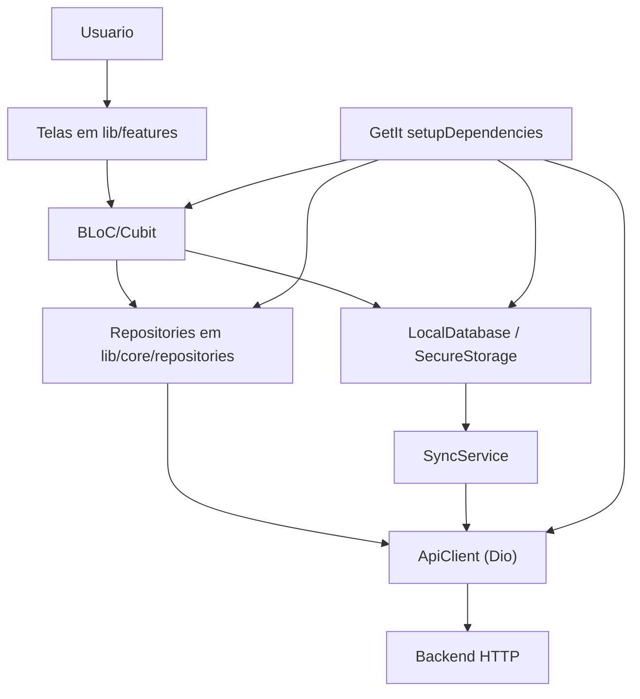
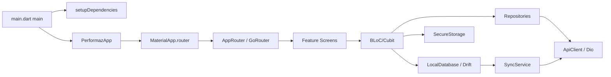
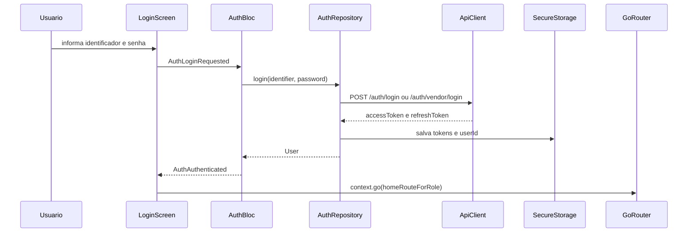
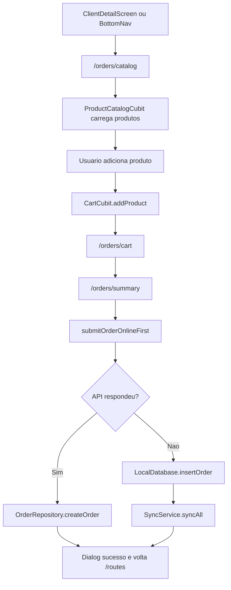
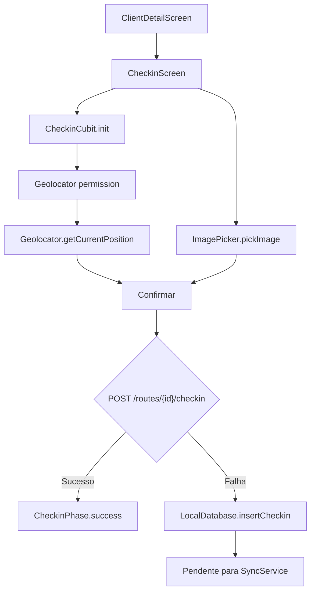
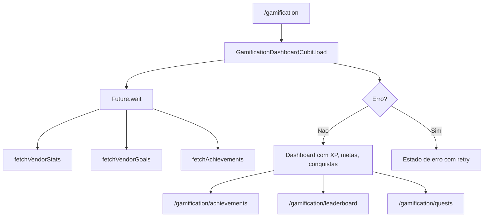
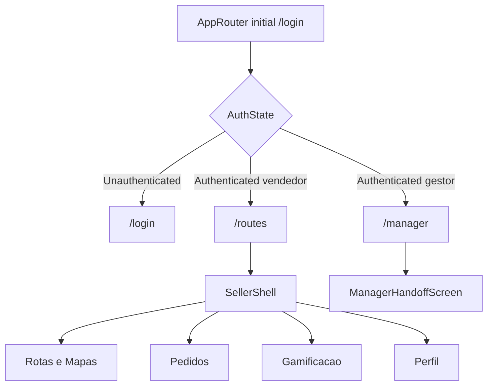
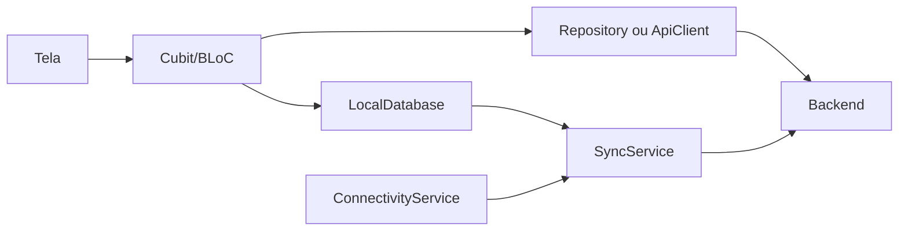

# Apresentacao Tecnica Completa do Projeto Flutter Performaz Mobile

## Sumario

1. [Escopo e metodo da auditoria](#1-escopo-e-metodo-da-auditoria)
2. [Inventario geral do projeto](#2-inventario-geral-do-projeto)
3. [Inventario de dependencias](#3-inventario-de-dependencias)
4. [Mapeamento completo das telas](#4-mapeamento-completo-das-telas)
5. [Matriz de componentes Flutter](#5-matriz-de-componentes-flutter)
6. [Arquitetura real identificada](#6-arquitetura-real-identificada)
7. [UI e UX](#7-ui-e-ux)
8. [Performance](#8-performance)
9. [Seguranca](#9-seguranca)
10. [Comparacao com alternativas](#10-comparacao-com-alternativas)
11. [Documentacao por modulo](#11-documentacao-por-modulo)
12. [Diagramas Mermaid](#12-diagramas-mermaid)
13. [Perguntas tecnicas da banca](#13-perguntas-tecnicas-da-banca)
14. [Justificativas tecnicas](#14-justificativas-tecnicas)
15. [Cola da apresentacao](#15-cola-da-apresentacao)
16. [Pontos a verificar manualmente](#16-pontos-a-verificar-manualmente)

---

## 1. Escopo e metodo da auditoria

Este documento descreve tecnicamente o projeto Flutter `performaz`, localizado na pasta raiz do aplicativo mobile. A analise foi feita a partir dos arquivos `pubspec.yaml`, `analysis_options.yaml`, `README.md`, `lib/`, `test/`, `android/`, `ios/` e `windows/`.

A regra adotada foi: toda tecnologia, arquitetura, widget, fluxo ou decisao citada precisa aparecer em arquivo, classe e, quando aplicavel, metodo. Quando a evidencia nao foi encontrada diretamente no codigo, o item foi marcado como "nao confirmado" ou encaminhado para a secao [Pontos a verificar manualmente](#16-pontos-a-verificar-manualmente).

Evidencias principais:

| Area | Evidencia no codigo |
|---|---|
| Inicializacao | `lib/main.dart`, metodo `main`; `lib/app/app.dart`, classe `PerformazApp`, metodo `_PerformazAppState.initState` |
| Dependencias | `pubspec.yaml`, secoes `dependencies` e `dev_dependencies` |
| Regras de analise | `analysis_options.yaml`, `include: package:flutter_lints/flutter.yaml` e regra `library_private_types_in_public_api: false` |
| Navegacao | `lib/app/router.dart`, classe `AppRouter`, propriedade `router`, metodo `_redirect` |
| Estado | `lib/core/auth/auth_bloc.dart`, classe `AuthBloc`; cubits em telas de rotas, pedidos, gamificacao e gestor |
| API | `lib/core/network/api_client.dart`, classe `ApiClient`; repositorios em `lib/core/repositories/` |
| Persistencia local | `lib/core/storage/local_database.dart`, classe `LocalDatabase`, tabelas Drift |
| DI | `lib/app/di.dart`, funcao `setupDependencies` e variavel `getIt` |
| Design system | `lib/app/theme/app_theme.dart`, `app_colors.dart`, `app_typography.dart`, `app_radius.dart` |
| Testes | Arquivos em `test/`, incluindo testes de autentificacao, pedidos, rotas, repositorios e perfil |

---

## 2. Inventario geral do projeto

### 2.1 Estrutura de pastas

| Pasta/arquivo | Funcao encontrada | Evidencia |
|---|---|---|
| `lib/main.dart` | Ponto de entrada; inicializa binding Flutter, DI e app | metodo `main` chama `WidgetsFlutterBinding.ensureInitialized`, `setupDependencies` e `runApp` |
| `lib/app/` | Composicao do app, roteador, DI, tema e shells | `PerformazApp`, `AppRouter`, `setupDependencies`, `SellerShell`, `ManagerShell` |
| `lib/core/auth/` | Autenticacao, login por identificador, estados e eventos | `AuthBloc`, `AuthRepository`, `loginIdentifierKind` |
| `lib/core/network/` | Cliente HTTP, conectividade e interceptors | `ApiClient`, `ConnectivityService`, `AuthInterceptor`, `AppLoggingInterceptor` |
| `lib/core/repositories/` | Repositorios de pedidos, CRUD, gestor e gamificacao | `OrderRepository`, `CrudRepository`, `ManagerRepository`, `GamificationRepository` |
| `lib/core/storage/` | Armazenamento seguro e banco local Drift | `SecureStorage`, `LocalDatabase` |
| `lib/core/sync/` | Sincronizacao offline/online | `SyncService`, metodos `_syncCheckins` e `_syncOrders` |
| `lib/features/auth/` | Login, recuperacao, perfil e mensagens de acao | `LoginScreen`, `ForgotPasswordScreen`, `ProfileScreen` |
| `lib/features/routes/` | Rota do vendedor, mapa da rota, detalhe do cliente e check-in | `RouteListScreen`, `RouteMapScreen`, `CreateRouteScreen`, `NavigateToClientScreen`, `RouteCubit`, `ClientDetailScreen`, `CheckinScreen` |
| `lib/features/orders/` | Catalogo, carrinho, resumo e visita sem venda | `ProductCatalogScreen`, `CartScreen`, `OrderSummaryScreen`, `NoSaleScreen` |
| `lib/features/gamification/` | Dashboard de XP, missões (quests), conquistas, ranking e progresso | `GamificationDashboard`, `QuestsScreen`, `AchievementsScreen`, `LeaderboardScreen`, `SellerGoalProgress` |
| `lib/features/manager/` | Telas gerenciais e tela de handoff para painel web | `ManagerHandoffScreen`, `DashboardScreen`, `GoalsScreen`, `LiveMapScreen`, CRUDs |
| `lib/shared/models/` | Modelos de dominio | `User`, `Product`, `Order`, `RouteStop`, `SalesRoute`, `Achievement` |
| `lib/shared/widgets/` | Widgets reutilizaveis | `AppCard`, `StatCard`, `SyncIndicator`, `OfflineAwareWidget`, `FilterPills` |
| `android/`, `ios/`, `windows/` | Projetos de plataforma gerados/configurados pelo Flutter | manifests, runners, registrantes de plugins |
| `assets/` | Nao encontrada na raiz | `assets` nao existe e `pubspec.yaml` nao declara assets |

### 2.2 Arquitetura encontrada

A arquitetura real e uma combinacao de organizacao feature-first com camadas compartilhadas:

| Camada | Evidencia | Interpretacao tecnica |
|---|---|---|
| Aplicacao | `lib/app/app.dart`, `PerformazApp`; `lib/app/router.dart`, `AppRouter` | Compoe providers globais, tema e roteamento |
| Interface por feature | `lib/features/**/**_screen.dart` | Telas agrupadas por modulo funcional |
| Estado | `AuthBloc`; cubits como `RouteCubit`, `CartCubit`, `ProductCatalogCubit`, `GamificationDashboardCubit` | BLoC para autenticacao e Cubit para estados de tela/modulo |
| Repositorios | `AuthRepository`, `OrderRepository`, `CrudRepository`, `ManagerRepository`, `GamificationRepository` | Camada de acesso a dados/API |
| Infraestrutura | `ApiClient`, `LocalDatabase`, `SecureStorage`, `ConnectivityService`, `SyncService` | HTTP, banco local, token seguro e sincronizacao |
| Modelos | `lib/shared/models/*.dart` | DTO/modelos de dominio simples com `Equatable` |

Nao foi encontrada uma Clean Architecture formal com separacao explicita `domain/data/presentation`, `usecases`, `entities` e `datasources`. O projeto usa uma arquitetura pragmatica de camadas, com features na UI e infraestrutura centralizada em `core`.

### 2.3 Tabela geral de tecnologias

| Tecnologia | Encontrada | Onde | Finalidade |
|---|---:|---|---|
| Flutter | Sim | `pubspec.yaml`; `lib/main.dart` | Framework de UI multiplataforma |
| Dart | Sim | Todo `lib/` | Linguagem do projeto |
| flutter_bloc | Sim | `pubspec.yaml`; `AuthBloc`; varios Cubits | Gerenciamento de estado |
| bloc | Indireto | `flutter_bloc` e `AuthBloc extends Bloc` | Base do padrao BLoC |
| Cubit | Sim | `RouteCubit`, `CartCubit`, `ProductCatalogCubit`, outros | Estado com menos boilerplate que BLoC |
| Provider | Nao como dependencia direta | `RepositoryProvider` de `flutter_bloc` em `PerformazApp` | Disponibiliza `ConnectivityService` |
| Riverpod | Nao | Nao consta em `pubspec.yaml` | Nao utilizado |
| get_it | Sim | `lib/app/di.dart`, `getIt` | Injecao/localizador de dependencias |
| injectable | Declarado | `pubspec.yaml` | Geracao de DI; uso direto nao confirmado em `lib/` |
| drift | Sim | `LocalDatabase`, `PendingCheckins`, `PendingOrders` | SQLite tipado/offline |
| sqlite | Sim, via Drift | `sqlite3_flutter_libs`; `NativeDatabase` | Banco local |
| dio | Sim | `ApiClient`, repositorios | Cliente HTTP |
| retrofit | Nao | Nao consta em `pubspec.yaml` | Nao utilizado |
| go_router | Sim | `AppRouter`, `GoRoute`, `ShellRoute` | Navegacao declarativa |
| auto_route | Nao | Nao consta em `pubspec.yaml` | Nao utilizado |
| hive | Nao | Nao consta em `pubspec.yaml` | Nao utilizado |
| shared_preferences | Nao | Nao consta em `pubspec.yaml` | Nao utilizado |
| flutter_secure_storage | Sim | `SecureStorage` | Tokens e user id seguros |
| workmanager | Declarado | `pubspec.yaml` | Tarefas em background; uso em `lib/` nao confirmado |
| connectivity_plus | Sim | `ConnectivityService`, `SyncService` | Status online/offline e sync |
| geolocator | Sim | `CheckinCubit.init` | Permissao e coordenadas de check-in |
| image_picker | Sim | `CheckinCubit.pickPhoto` | Foto comprobatória do check-in |
| url_launcher | Sim | `ClientDetailScreen`, metodos de launch | Abrir app de telefone/mapas |
| firebase_core/firebase_messaging | Declarado | `pubspec.yaml` | Mensageria; uso em `lib/` nao confirmado |
| fl_chart | Sim | `DashboardScreen`, `_RevenueChart` | Grafico de receita |
| flutter_map/latlong2 | Sim | `LiveMapScreen`, `_MapView` | Mapa gerencial |
| csv/file_picker/share_plus | Declarado | `pubspec.yaml`; snackbars nos CRUDs | Import/export declarado, implementacao real nao confirmada |
| cached_network_image | Declarado | `pubspec.yaml` | Cache de imagens; uso em `lib/` nao confirmado |
| google_fonts | Sim | `AppTypography`, `AppTheme` | Tipografia Outfit, Inter e Roboto Mono |
| intl | Sim | Telas de gamificacao/dashboard usam formatacao | Datas e numeros |
| uuid | Declarado | `pubspec.yaml` | IDs locais; uso direto em `lib/` nao confirmado |
| logger | Sim | `SyncService`, `AppLoggingInterceptor` | Logs de sync e rede |

### 2.4 Navegacao

A navegacao usa `go_router`, evidenciada em `lib/app/router.dart`, classe `AppRouter`, propriedade `router`.

Rotas confirmadas:

| Rota | Tela/classe | Observacoes |
|---|---|---|
| `/login` | `LoginScreen` | Rota inicial |
| `/forgot-password` | `ForgotPasswordScreen` | Recuperacao de senha |
| `/routes` | `RouteListScreen` | Dentro de `ShellRoute` do vendedor |
| `/routes/map` | `RouteMapScreen` | Mapa do vendedor dentro de `ShellRoute` |
| `/routes/create` | `CreateRouteScreen` | Criacao de nova rota |
| `/routes/:clientId` | `ClientDetailScreen` | Recebe `RouteStop` por `state.extra` |
| `/routes/:clientId/checkin` | `CheckinScreen` | Recebe `RouteStop` por `state.extra` |
| `/routes/:clientId/navigate` | `NavigateToClientScreen` | Tela de navegacao recebendo `RouteStop` |
| `/orders/catalog` | `ProductCatalogScreen` | Inicializa carrinho se `clientId` vier em `extra` |
| `/orders/cart` | `CartScreen` | Carrinho do pedido |
| `/orders/summary` | `OrderSummaryScreen` | Confirmacao do pedido |
| `/orders/no-sale` | `NoSaleScreen` | Registro de visita sem venda |
| `/gamification` | `GamificationDashboard` | Dashboard do vendedor |
| `/gamification/quests` | `QuestsScreen` | Missoes ativas do vendedor |
| `/gamification/achievements` | `AchievementsScreen` | Conquistas |
| `/gamification/leaderboard` | `LeaderboardScreen` | Ranking |
| `/profile` | `ProfileScreen` | Perfil do vendedor |
| `/manager` | `ManagerHandoffScreen` | Handoff para painel web |

O controle de acesso esta em `AppRouter._redirect`: usuarios nao autenticados fora de `/login` e `/forgot-password` sao redirecionados para `/login`; usuarios autenticados tentando acessar essas rotas sao enviados para `homeRouteForRole`, em `lib/app/role_home_route.dart`. `UserRole.gestor` leva para `/manager`; `UserRole.vendedor` leva para `/routes`.

### 2.5 Gerenciamento de estado

| Tipo | Onde | Finalidade |
|---|---|---|
| BLoC | `AuthBloc` em `lib/core/auth/auth_bloc.dart` | Eventos de login, logout, verificacao, edicao de perfil e troca de senha |
| Cubit | `RouteCubit`, `CartCubit`, `ProductCatalogCubit`, `NoSaleCubit`, `CheckinCubit`, `GamificationDashboardCubit`, `LeaderboardCubit`, `AchievementsCubit` | Estado local/modular de telas |
| Equatable | Estados e modelos | Comparacao por valor para evitar rebuilds desnecessarios e facilitar testes |
| MultiBlocProvider | `PerformazApp` e `AppRouter` | Disponibiliza `AuthBloc` global e cubits do shell do vendedor |
| RepositoryProvider | `PerformazApp` | Expoe `ConnectivityService` |

### 2.6 Persistencia local

O projeto usa Drift/SQLite. Evidencia: `lib/core/storage/local_database.dart`, anotacao `@DriftDatabase`, classe `LocalDatabase`, tabelas `PendingCheckins`, `PendingOrders`, `CachedClients`, `CachedProducts`.

| Tabela | Classe | Finalidade |
|---|---|---|
| `PendingCheckins` | `PendingCheckins extends Table` | Fila offline de check-ins pendentes |
| `PendingOrders` | `PendingOrders extends Table` | Fila offline de pedidos pendentes |
| `CachedClients` | `CachedClients extends Table` | Cache local de clientes |
| `CachedProducts` | `CachedProducts extends Table` | Cache local de produtos |

Metodos relevantes:

| Metodo | Classe | Funcao |
|---|---|---|
| `insertCheckin` | `LocalDatabase` | Insere check-in pendente |
| `getUnsyncedCheckins` | `LocalDatabase` | Lista check-ins nao sincronizados |
| `markCheckinSynced` | `LocalDatabase` | Marca check-in sincronizado |
| `insertOrder` | `LocalDatabase` | Insere pedido pendente |
| `getUnsyncedOrders` | `LocalDatabase` | Lista pedidos nao sincronizados |
| `markOrderSynced` | `LocalDatabase` | Marca pedido sincronizado |
| `cacheClient`/`cacheProduct` | `LocalDatabase` | Grava cache em JSON (definido, porem sem integracao direta no repositorio) |

### 2.7 Comunicacao com API

A comunicacao HTTP usa Dio encapsulado em `ApiClient`, arquivo `lib/core/network/api_client.dart`.

Configuracoes confirmadas:

| Item | Evidencia |
|---|---|
| Base URL por ambiente | `ApiClient`, construtor, `String.fromEnvironment('API_BASE_URL', defaultValue: 'http://localhost:3333/api')` |
| Timeout | `connectTimeout` e `receiveTimeout` de 10 segundos |
| Headers | `Content-Type: application/json` e `Accept: application/json` |
| Interceptor de autenticacao | `AuthInterceptor` adiciona `Authorization: Bearer $token` |
| Log em debug | `if (kDebugMode) AppLoggingInterceptor()` |
| Metodos HTTP | `get`, `post`, `put`, `patch`, `delete`, `upload` |

Endpoints confirmados por codigo:

| Recurso | Arquivo/classe/metodo | Endpoint |
|---|---|---|
| Login gestor | `AuthRepository.login` | `POST /auth/login` |
| Login vendedor | `AuthRepository.login` | `POST /auth/vendor/login` |
| Refresh token | `AuthRepository.refreshToken` | `POST /auth/refresh` |
| Perfil vendedor | `AuthRepository._hydrateUser` | `GET /vendors/{id}` |
| Atualizar vendedor | `AuthRepository.updateVendorProfile` | `PUT /vendors/{id}` |
| Trocar senha | `AuthRepository.changeVendorPassword` | `POST /auth/vendor/change-password` |
| Rotas do vendedor | `RouteCubit.loadRoute` | `GET /routes?date&vendorId` |
| Detalhe da rota | `RouteCubit.loadRoute` | `GET /routes/{routeId}` |
| Clientes | `RouteCubit.loadRoute`, `CrudRepository.fetchClients` | `GET /clients` |
| Reordenar parada | `RouteCubit.reorderStops` | `PATCH /routes/{routeId}/stops/{stopId}` |
| Check-in | `CheckinCubit.confirm`, `SyncService._syncCheckins` | `POST /routes/{routeId}/checkin` |
| Pedido | `OrderRepository.createOrder`, `SyncService._syncOrders` | `POST /orders` |
| Produtos | `CrudRepository.fetchProducts` | `GET /products` |
| Gamificacao stats | `GamificationRepository.fetchVendorStats` | `GET /gamification/vendors/{vendorId}/stats` |
| Conquistas | `GamificationRepository.fetchAchievements` | metodo em repositorio de gamificacao |
| Ranking | `GamificationRepository.fetchLeaderboard` | endpoint de gamificacao/leaderboard no metodo |
| KPIs gestor | `ManagerRepository.fetchKpis` | `GET /dashboard/kpis` |
| Receita diaria | `ManagerRepository.fetchDailyRevenue` | endpoint em `fetchDailyRevenue` |
| Mapa | `ManagerRepository.fetchVendorLocations` | `GET /gamification/map` |
| Metas | `ManagerRepository.fetchGoals`, `createGoal`, `updateGoal` | `GET/POST/PUT /goals` |
| Notificacoes | `ManagerRepository.fetchNotifications`, `sendNotification` | `GET/POST /notifications` |

### 2.8 Injecao de dependencia

A DI usa `GetIt`. Evidencia: `lib/app/di.dart`, variavel `final getIt = GetIt.instance` e funcao `setupDependencies`.

Dependencias registradas:

| Registro | Tipo | Onde e por que |
|---|---|---|
| `SecureStorage` | lazy singleton | Tokens e user id |
| `ApiClient` | lazy singleton | Reutiliza Dio e interceptors |
| `ConnectivityService` | lazy singleton | Status online/offline |
| `LocalDatabase` | lazy singleton | Banco Drift; usa `NativeDatabase.memory` em testes quando configurado |
| `SyncService` | lazy singleton | Sincronizacao de check-ins e pedidos |
| `AuthRepository` | lazy singleton | Autenticacao |
| `AuthBloc` | factory | Novo BLoC por solicitacao |
| `GamificationRepository` | lazy singleton | Dados de gamificacao |
| `ManagerRepository` | lazy singleton | Dados gerenciais |
| `CrudRepository` | lazy singleton | CRUD de vendedores, clientes e produtos |
| `OrderRepository` | lazy singleton | Pedidos |

### 2.9 Design system

O design system esta implementado em quatro arquivos:

| Arquivo | Classe | Conteudo |
|---|---|---|
| `lib/app/theme/app_colors.dart` | `AppColors` | Paleta, status semanticos, sidebar, charts, XP |
| `lib/app/theme/app_typography.dart` | `AppTypography` | Fontes Google: Outfit, Inter, Roboto Mono |
| `lib/app/theme/app_radius.dart` | `AppRadius` | Escala de radius em pixels |
| `lib/app/theme/app_theme.dart` | `AppTheme` | `ThemeData` light/dark, Material 3, componentes tematicos |

Material Design confirmado: `AppTheme.dark` e `AppTheme.light` definem `useMaterial3: true`.

### 2.10 Servicos

| Servico | Arquivo/classe | Responsabilidade |
|---|---|---|
| API | `ApiClient` | Encapsular Dio |
| Conectividade | `ConnectivityService` | Stream de online/offline e checagem |
| Sync | `SyncService` | Enviar pendencias de check-in e pedido ao voltar online |
| Storage seguro | `SecureStorage` | Persistir tokens e user id com `FlutterSecureStorage` |
| Banco local | `LocalDatabase` | Drift/SQLite para fila e cache |

---

## 3. Inventario de dependencias

### 3.1 Dependencias de producao

| Dependencia | Versao | Onde e utilizada | Finalidade | Beneficios | Limitacoes | Alternativas | Motivo tecnico da escolha |
|---|---:|---|---|---|---|---|---|
| `flutter` | SDK | Todo app | UI multiplataforma | Ecossistema maduro, Android/iOS/Windows | Requer runtime Flutter | React Native, nativo | Projeto e 100% Flutter |
| `cupertino_icons` | ^1.0.8 | Declarada; uso direto nao confirmado | Icones estilo iOS | Simples | Nao substitui biblioteca de icones completa | Material Icons | Nao foi possivel confirmar uso atraves do codigo |
| `flutter_bloc` | ^9.1.0 | `AuthBloc`, Cubits, `BlocBuilder`, `BlocConsumer` | Estado | Padrao testavel e previsivel | Boilerplate em BLoC completo | Provider, Riverpod | Adequado a fluxos com estados claros |
| `equatable` | ^2.0.7 | Modelos e estados | Comparacao por valor | Menos codigo em igualdade | Exige props manuais | Freezed, records | Facilita Cubit/BLoC e testes |
| `go_router` | ^15.1.2 | `AppRouter`, shells, `context.go/push` | Navegacao | Rotas declarativas e redirect | `state.extra` exige cuidado de tipo | Navigator 2, auto_route | Redirect por autenticacao e shells |
| `dio` | ^5.8.0+1 | `ApiClient`, interceptors | HTTP | Interceptors, timeout, upload | Mais complexo que `http` | http, Chopper, Retrofit | Tokens e logging precisam de interceptors |
| `drift` | ^2.25.0 | `LocalDatabase` | SQLite tipado | Queries tipadas, migrations | Geracao de codigo | Hive, sqflite | Fila offline estruturada |
| `sqlite3_flutter_libs` | ^0.5.30 | Infra do Drift | SQLite embarcado | Suporte multiplataforma | Tamanho extra | sqflite | Necessario para Drift/native |
| `path_provider` | ^2.1.5 | `di.dart`, `_openDatabase` | Caminho do banco | Caminho correto por plataforma | Assincrono | path manual | Evita hardcode |
| `get_it` | ^8.0.3 | `di.dart` | DI/service locator | Simples e direto | Dependencias globais podem ocultar acoplamento | Riverpod, Provider | Padrao pragmatica para app pequeno/medio |
| `injectable` | ^2.5.0 | Declarada; uso direto nao confirmado | Geracao de DI | Reduz boilerplate quando usado | Requer build runner | get_it manual | Nao foi possivel confirmar uso atraves do codigo |
| `google_fonts` | ^6.2.1 | `AppTypography`, `AppTheme` | Tipografia | Fontes consistentes | Download/cache de fontes | Fontes assets, system fonts | Replica identidade visual |
| `flutter_secure_storage` | ^9.2.4 | `SecureStorage` | Tokens seguros | Criptografia e Keychain/Keystore | Pode variar por plataforma | shared_preferences, Hive criptografado | Token nao deve ir para storage simples |
| `connectivity_plus` | ^6.1.4 | `ConnectivityService`, `SyncService` | Online/offline | Stream de conectividade | Nao garante internet real | ping HTTP, internet_connection_checker | Aciona sync ao reconectar |
| `geolocator` | ^13.0.2 | `CheckinCubit.init` | Localizacao | Permissao e GPS | Requer permissoes nativas | location | Check-in precisa de coordenadas |
| `image_picker` | ^1.1.2 | `CheckinCubit.pickPhoto` | Foto | Camera/galeria | Permissoes e arquivos locais | camera | Comprovante visual de visita |
| `url_launcher` | ^6.3.1 | `ClientDetailScreen` | Telefonar / Abrir Maps | Delegacao facil para apps externos | Exige configuracao em iOS (Info.plist) | Integracao manual | Agiliza acoes de contato e navegacao |
| `firebase_messaging` | ^15.2.5 | Declarada; uso direto nao confirmado | Push | Integracao FCM | Configuracao nativa | OneSignal | Nao foi possivel confirmar uso atraves do codigo |
| `firebase_core` | ^3.12.1 | Declarada; uso direto nao confirmado | Inicializacao Firebase | Base para plugins Firebase | Requer config por plataforma | N/A | Nao foi possivel confirmar uso atraves do codigo |
| `workmanager` | ^0.9.0+3 | Declarada; uso direto nao confirmado | Background tasks | Sincronizacao agendada possivel | Diferencas por plataforma | background_fetch | Nao foi possivel confirmar uso atraves do codigo |
| `fl_chart` | ^0.70.2 | `DashboardScreen`, `_RevenueChart` | Graficos | Visual customizavel | Pode exigir ajustes finos | syncfusion, charts_flutter | KPIs gerenciais |
| `csv` | ^6.0.0 | Declarada; uso direto nao confirmado | CSV | Parsing/encoding | Nao gerencia arquivos | Excel packages | CRUDs exibem acoes de CSV, mas implementacao nao confirmada |
| `file_picker` | ^8.0.0 | Declarada; uso direto nao confirmado | Selecionar arquivos | UX nativa | Permissoes | document_picker | Nao confirmado em `lib/` |
| `share_plus` | ^10.0.0 | Declarada; uso direto nao confirmado | Compartilhar arquivos | Compartilhamento nativo | Plataforma-dependente | APIs nativas | Nao confirmado em `lib/` |
| `flutter_map` | ^7.0.2 | `LiveMapScreen`, `_MapView` | Mapa | OpenStreetMap, flexivel | Requer tiles/rede | google_maps_flutter | Mapa gerencial sem SDK proprietario |
| `latlong2` | ^0.9.1 | `LiveMapScreen`, `LatLng` | Coordenadas | Compatibilidade com flutter_map | Focado em geo | geolocator models | Necessario ao mapa |
| `cached_network_image` | ^3.4.1 | Declarada; uso direto nao confirmado | Cache de imagens | Performance para imagens remotas | Cache invalidation | Image.network | Nao confirmado em `lib/` |
| `logger` | ^2.5.0 | `SyncService`, `AppLoggingInterceptor` | Logs | Logs estruturados | Pode vazar dados se mal usado | print, logging | Debug de sync/rede |
| `intl` | ^0.20.2 | Telas de gamificacao/dashboard | Formatacao | Datas/numeros locais | Configuracao locale | formatacao manual | UI com valores financeiros/datas |
| `uuid` | ^4.5.1 | Declarada; uso direto nao confirmado | IDs locais | Evita colisao quando usado | IDs nao semanticos | backend IDs | Nao foi possivel confirmar uso atraves do codigo |

### 3.2 Dependencias de desenvolvimento

| Dependencia | Onde | Finalidade |
|---|---|---|
| `flutter_test` | `test/*.dart` | Testes Flutter e unitarios |
| `flutter_lints` | `analysis_options.yaml` | Regras recomendadas |
| `injectable_generator` | `pubspec.yaml` | Geracao de DI; uso nao confirmado |
| `build_runner` | `pubspec.yaml` | Geracao de codigo |
| `drift_dev` | `pubspec.yaml`; `local_database.g.dart` | Geracao Drift |
| `bloc_test` | `pubspec.yaml`; testes de BLoC/Cubit | Testes de estado |
| `mocktail` | testes de repositorio/auth | Mocks |

---

## 4. Mapeamento completo das telas

### 4.1 Autenticacao

| Tela | Arquivo/classe | Responsabilidade | Quem abre | Navega para | Estado/componentes | Integracoes/regras |
|---|---|---|---|---|---|---|
| Login | `lib/features/auth/login_screen.dart`, `LoginScreen`, `_LoginScreenState._submit` | Autenticar vendedor/gestor | `/login`, rota inicial | `homeRouteForRole`, `/forgot-password` | `Form`, `TextFormField`, `BlocBuilder`, `SnackBar`, estado local de erro/tentativas | Dispara `AuthLoginRequested` em `AuthBloc`; email tende a gestor e matricula a vendedor via `loginIdentifierKind` |
| Recuperacao de senha | `forgot_password_screen.dart`, `ForgotPasswordScreen`, `_submit` | Solicitar recuperacao | `LoginScreen` por `context.push('/forgot-password')` | `context.pop()` | `TextFormField`, `SnackBar` | Mensagem de indisponibilidade/fluxo local; integracao real nao confirmada |
| Perfil | `profile_screen.dart`, `ProfileScreen`, `_showEditProfileDialog`, `_showChangePasswordDialog` | Exibir/editar dados do usuario | `/profile` e bottom nav | `/login` apos logout | `BlocBuilder`, `ListView`, `Dialog`, `TextFormField` | Usa `AuthProfileUpdateRequested`, `AuthPasswordChangeRequested`, `AuthLogoutRequested` |

### 4.2 Rotas e check-in

| Tela | Arquivo/classe | Responsabilidade | Quem abre | Navega para | Estado/componentes | Integracoes/regras |
|---|---|---|---|---|---|---|
| Lista de rotas | `route_list_screen.dart`, `RouteListScreen` | Mostrar rota do dia e permitir reordenacao | `/routes`, bottom nav | detalhe do cliente, rotas/map, criar rota | `BlocBuilder<RouteCubit, RouteState>`, `ReorderableListView.builder`, `CircularProgressIndicator` | `RouteCubit.loadRoute`, `RouteCubit.reorderStops` |
| Mapa de rota | `route_map_screen.dart`, `RouteMapScreen` | Ver caminho geral da rota | `/routes/map` | detalhes da rota | `FlutterMap`, `MarkerLayer` | Integrado via `ShellRoute` |
| Criacao de rota | `create_route_screen.dart`, `CreateRouteScreen` | Fluxo de nova rota | `/routes/create` | volta para lista | UI de form, estado local | Utilizado no fluxo do vendedor |
| Detalhe do cliente | `client_detail_screen.dart`, `ClientDetailScreen` | Dados do cliente/parada e acoes | lista de rotas | check-in, catalogo, sem venda, navegacao | `ListView`, botoes, `url_launcher` | Usa `RouteStop` via `state.extra`. Dispara telefone/mapa. |
| Check-in | `checkin_screen.dart`, `CheckinScreen`, `CheckinCubit` | Capturar localizacao/foto e registrar visita | detalhe do cliente | volta para rota | `BlocConsumer`, `ListView`, `SnackBar`, fases `CheckinPhase` | Usa `Geolocator`, `ImagePicker`, `ApiClient.post`; salva `PendingCheckinsCompanion` offline |
| Navegacao | `navigate_to_client_screen.dart`, `NavigateToClientScreen` | Visualizar proxima parada | `/routes/:id/navigate` | volta ou check-in | UI informacional | Confirma a passagem para parada |

### 4.3 Pedidos

| Tela | Arquivo/classe | Responsabilidade | Quem abre | Navega para | Estado/componentes | Integracoes/regras |
|---|---|---|---|---|---|---|
| Catalogo | `product_catalog_screen.dart`, `ProductCatalogScreen`, `ProductCatalogCubit` | Buscar/filtrar produtos e adicionar ao carrinho | bottom nav ou detalhe do cliente | carrinho por snackbar | `TextField`, `ListView.separated`, debounce `Timer`, categorias | `ApiProductSource.fetchProducts` usa `CrudRepository.fetchProducts`; filtros por busca/categoria |
| Carrinho | `cart_screen.dart`, `CartScreen`, `CartCubit` | Quantidades, remocao, observacoes | `/orders/cart` | `/orders/summary` | `BlocBuilder`, `ListView`, stepper | Regras de total, incremento, decremento, `clear` |
| Resumo | `order_summary_screen.dart`, `OrderSummaryScreen`, `_onConfirm` | Confirmar pedido | carrinho | `/routes` apos sucesso | `BlocBuilder<CartCubit, CartState>`, `Dialog`, `SnackBar` | `submitOrderOnlineFirst`; tenta `OrderRepository.createOrder`, salva `PendingOrdersCompanion` se falhar |
| Sem venda | `no_sale_screen.dart`, `NoSaleScreen`, `NoSaleCubit` | Registrar motivo de visita sem venda | detalhe do cliente | `/routes` | `BlocConsumer`, `RadioGroup`, `RadioListTile`, `TextField`, `Dialog` | Valida motivo, usa `apiClient.post(buildNoSaleRoutePath(routeId))`, atualiza `RouteCubit.markClientNoSale` |

### 4.4 Gamificacao

| Tela | Arquivo/classe | Responsabilidade | Quem abre | Navega para | Estado/componentes | Integracoes/regras |
|---|---|---|---|---|---|---|
| Dashboard de gamificacao | `gamification_dashboard.dart`, `GamificationDashboard`, `GamificationDashboardCubit.load` | Mostrar XP, nivel, metas, proximas conquistas e eventos | `/gamification` | conquistas/ranking/quests | `BlocBuilder`, `RefreshIndicator`, `ListView`, `LinearProgressIndicator`, cards | Usa `Future.wait` com repositorio de gamificacao |
| Missoes | `quests_screen.dart`, `QuestsScreen` | Exibir quests (desafios em aberto) | `/gamification/quests` | volta | `ListView`, badges de meta | Gamificacao do vendedor |
| Conquistas | `achievements_screen.dart`, `AchievementsScreen`, `AchievementsCubit.load` | Grade de badges/conquistas | `/gamification/achievements` | volta | `GridView.builder`, animacao em `_AchievementCardState` | `GamificationRepository.fetchAchievements` |
| Ranking | `leaderboard_screen.dart`, `LeaderboardScreen`, `LeaderboardCubit` | Podio e lista ranqueada | `/gamification/leaderboard` | volta | `ListView.separated`, filtros `LeaderboardPeriod` e `LeaderboardMetric` | Usa `SecureStorage.getUserId` e `GamificationRepository.fetchLeaderboard` |

### 4.5 Gestor

Observacao de precisao: O codigo contem um shell gerencial completo (`ManagerShell` em `lib/app/shell/manager_shell.dart`) com navegacao sidebar para rotas como `/manager/sellers`, `/manager/goals`, etc. Porem, o roteador (`AppRouter`) atualmente registra APENAS `/manager` redirecionando para a tela `ManagerHandoffScreen`.

| Tela | Arquivo/classe | Responsabilidade | Estado/componentes | Integracoes/regras |
|---|---|---|---|---|
| Handoff gestor | `manager_handoff_screen.dart`, `ManagerHandoffScreen` | Informar que painel gestor fica no web | `Scaffold`, `SafeArea`, `OutlinedButton` | URL estatica `http://localhost:3000/login`; logout via `AuthBloc` |
| Manager Shell | `shell/manager_shell.dart`, `ManagerShell` | Layout com sidebar p/ painel web gerencial | `Row`, `Container`, `_ManagerSidebar`, `_NavItem` | Menu de gestor completo implementado mas desligado do router ativo |
| Dashboard gestor | `dashboard_screen.dart`, `DashboardScreen`, `DashboardCubit.load` | KPIs e grafico semanal | `BlocBuilder`, `StatCard`, `BarChart` | `ManagerRepository.fetchKpis`, `fetchDailyRevenue` |
| Metas | `goals_screen.dart`, `GoalsScreen`, `GoalsCubit` | Editar metas por vendedor | `BlocBuilder`, dialog com `TextField` | `ManagerRepository.fetchGoals`, `fetchVendors`, `updateGoal/createGoal` |
| Mapa ao vivo | `live_map_screen.dart`, `LiveMapScreen`, `LiveMapCubit` | Exibir vendedores no mapa | `FlutterMap`, `TileLayer`, `MarkerLayer`, `ListView` | `ManagerRepository.fetchVendorLocations`; ha delay/mock em `_fetchPositions` |
| Rotas gerenciais | `routes_builder.dart`, `RoutesBuilderScreen`, `RoutesBuilderCubit` | Atribuir clientes a vendedores | listas, paineis e acoes | `getIt<ApiClient>().post('/routes', data: ...)`; pendencia em load |
| Notificacoes | `notifications_screen.dart`, `NotificationsScreen`, `NotificationsCubit` | Enviar e listar notificacoes | compose/history cards | `ManagerRepository.fetchNotifications`, `sendNotification` |
| CRUD vendedores | `crud/sellers_crud.dart`, `SellersCrudScreen`, `SellersCrudCubit` | Listar, filtrar, editar vendedores | `TextField`, dialog, paginacao | `CrudRepository.fetchVendors`; add/update/delete local |
| CRUD clientes | `crud/clients_crud.dart`, `ClientsCrudScreen`, `ClientsCrudCubit` | Listar, filtrar, editar clientes | `TextField`, dialog, paginacao | Carrega mock por delay; integracao real nao confirmada |
| CRUD produtos | `crud/products_crud.dart`, `ProductsCrudScreen`, `ProductsCrudCubit` | Listar, filtrar, editar produtos | `TextField`, dialog, paginacao | Carrega mock por delay; integracao real nao confirmada |

---

## 5. Matriz de componentes Flutter

| Widget/componente | Onde e usado | O que faz | Alternativas | Motivo da escolha no projeto |
|---|---|---|---|---|
| `MaterialApp.router` | `PerformazApp.build` | App com roteamento declarativo | `MaterialApp` + Navigator | Necessario ao `GoRouter` |
| `Scaffold` | Telas principais | Estrutura de tela | `CustomScrollView` puro | Padrao Material para app bar/body/nav |
| `SafeArea` | `ManagerHandoffScreen`, `OrderSummaryScreen` | Evita areas inseguras | padding manual | Mobile precisa respeitar notch/barras |
| `AppBar` | rotas, pedidos, gamificacao | Cabecalho | header custom | Consistencia Material |
| `NavigationBar` | `SellerShell`, `_SellerBottomNav` | Navegacao inferior Material 3 | `BottomNavigationBar` | Projeto usa `useMaterial3: true` |
| `ShellRoute` | `AppRouter.router` | Agrupa rotas com shell de vendedor | rotas duplicando shell | Mantem bottom nav e providers comuns |
| `MultiBlocProvider` | `PerformazApp`, `AppRouter` | Injeta varios bloc/cubits | providers separados | Reduz aninhamento |
| `BlocBuilder` | rotas, pedidos, auth, gestor | Renderiza por estado | `ValueListenableBuilder`, Riverpod | Integrado ao `flutter_bloc` |
| `BlocConsumer` | `CheckinScreen`, `NoSaleScreen` | Render + efeitos colaterais | `BlocListener` + `BlocBuilder` | Snackbars/dialogs com UI de estado |
| `ListView` | perfil, detalhes, dashboards | Listas/scroll | `SingleChildScrollView` + Column | Conteudo rolavel |
| `ListView.separated` | catalogo, ranking, CRUDs | Lista com separadores | `ListView.builder` | Separadores declarativos |
| `ReorderableListView.builder` | `RouteListScreen` | Reordenacao de paradas | drag manual | Fluxo de rota por prioridade |
| `GridView.builder` | `AchievementsScreen` | Grade de conquistas | `Wrap`, `ListView` | Badges em matriz |
| `TextField` | catalogo, sem venda, CRUDs | Entrada simples | `TextFormField` | Busca/notas sem validacao de form |
| `TextFormField` | login, perfil | Entrada validavel | `TextField` | Validacao e `Form` |
| `RefreshIndicator` | `GamificationDashboard` | Pull-to-refresh | botao atualizar | UX comum mobile |
| `SnackBar` | login, catalogo, check-in, CRUDs | Feedback temporario | dialog, toast externo | Padrao Material |
| `AlertDialog`/`showDialog` | perfil, resumo pedido, sem venda, metas/CRUDs | Confirmacoes/edicoes | bottom sheet | Focado em decisoes pontuais |
| `CircularProgressIndicator` | loading em varias telas | Estado de carregamento | skeleton shimmer | Simples e reconhecivel |
| `LinearProgressIndicator` | gamificacao/metas | Progresso | barras custom | Progresso de XP/metas |
| `BarChart` | `DashboardScreen._RevenueChart` | Grafico de receita | charts nativos/manual | `fl_chart` declarado e usado |
| `FlutterMap` | `LiveMapScreen._MapView`, `RouteMapScreen` | Mapa interativo | Google Maps | OpenStreetMap/flexibilidade |
| `AppCard` | telas de pedido e shared UI | Card padronizado | `Card` direto | Consistencia visual |
| `StatCard` | dashboard/gamificacao | KPI compacto | card custom por tela | Reuso de metricas |
| `SyncIndicator` | shared | Indica pendencias/sync | snackbar permanente | Feedback offline |
| `OfflineAwareWidget` | `SellerShell` | Awareness de conectividade | banner por tela | Centraliza estado offline no shell |

---

## 6. Arquitetura real identificada

### 6.1 Camadas

Esta arquitetura nao implementa todos os elementos classicos de Clean Architecture. Nao ha use cases separados, interfaces de repositorio por contrato em `lib/`, nem camada `domain` isolada. O padrao real e:

- Feature-first na UI: `lib/features/auth`, `routes`, `orders`, `gamification`, `manager`.
- Core infrastructure: `lib/core/network`, `storage`, `repositories`, `sync`, `auth`.
- Shared models/widgets: `lib/shared/models`, `lib/shared/widgets`.

### 6.2 Fluxo de dados vendedor

1. `LoginScreen._submit` envia `AuthLoginRequested`.
2. `AuthBloc._onLoginRequested` chama `AuthRepository.login`.
3. `AuthRepository.login` escolhe endpoint por `loginIdentifierKind`, salva tokens no `SecureStorage` e hidrata usuario vendedor com `GET /vendors/{id}`.
4. `AppRouter._redirect` envia vendedor autenticado para `/routes`.
5. `ShellRoute` cria `CartCubit`, `ProductCatalogCubit` e `RouteCubit`.
6. `RouteCubit.loadRoute` busca rota e clientes via API.
7. Check-in/pedidos tentam API primeiro; se falhar, usam `LocalDatabase`.
8. `SyncService` sincroniza pendencias quando `ConnectivityService` sinaliza retorno online.

### 6.3 Repository Pattern

O padrao Repository esta confirmado nominalmente e estruturalmente em:

| Repositorio | Arquivo | Metodos principais | Responsabilidade |
|---|---|---|---|
| `AuthRepository` | `core/auth/auth_repository.dart` | `login`, `logout`, `getCurrentUser`, `refreshToken`, `updateVendorProfile` | Auth e perfil |
| `OrderRepository` | `core/repositories/order_repository.dart` | `fetchOrders`, `fetchOrder`, `createOrder` | Pedidos |
| `CrudRepository` | `core/repositories/crud_repository.dart` | `fetch/create/update/deleteVendor/Client/Product` | CRUD administrativo |
| `GamificationRepository` | `core/repositories/gamification_repository.dart` | `fetchVendorStats`, `fetchAchievements`, `fetchVendorGoals`, `fetchLeaderboard` | Gamificacao |
| `ManagerRepository` | `core/repositories/manager_repository.dart` | `fetchKpis`, `fetchDailyRevenue`, `fetchVendorLocations`, `fetchGoals`, `sendNotification` | Gestao |

### 6.4 Service Layer

Service layer confirmada parcialmente:

| Service | Arquivo/classe | Observacao |
|---|---|---|
| `SyncService` | `core/sync/sync_service.dart` | Servico claro de sincronizacao |
| `ConnectivityService` | `core/network/connectivity_service.dart` | Servico de conectividade |
| `SecureStorage` | `core/storage/secure_storage.dart` | Wrapper de storage seguro |
| `ApiClient` | `core/network/api_client.dart` | Wrapper HTTP |

Nao ha uma pasta `services/` geral; os servicos estao distribuidos por `core`.

### 6.5 DTOs, Models e Entities

Models confirmados:

| Modelo | Arquivo/classe | Observacao |
|---|---|---|
| Usuario | `shared/models/user.dart`, `User`, `UserRole` | Modelo com role, matricula, XP e status |
| Produto | `shared/models/product.dart`, `Product` | Produto do catalogo |
| Pedido | `shared/models/order.dart`, `Order`, `OrderItem`, `OrderStatus` | Pedido e itens |
| Rota | `shared/models/route.dart`, `RouteStop`, `SalesRoute`, `VisitStatus` | Roteiro e status de visitas |
| Cliente | `shared/models/client.dart`, `Client` | Cliente |
| Conquista | `shared/models/achievement.dart`, `Achievement`, `XpEvent` | Gamificacao |

DTOs formais separados nao foram encontrados. Conversoes `fromJson/toJson` nos modelos e mapas diretamente nos repositorios funcionam como DTOs informais. Entities separadas de models tambem nao foram encontradas.

### 6.6 Dependency Injection

A DI e manual via `GetIt`, nao via annotations do `injectable`. Embora `injectable` esteja declarado, nao foi encontrado uso de anotacoes `@injectable`, `@module` ou inicializadores gerados no codigo auditado.

### 6.7 Navegacao

`GoRouter` centraliza todas as rotas mobile confirmadas. A navegacao por role usa `homeRouteForRole(UserRole role)`.

Risco tecnico: algumas rotas exigem `state.extra! as models.RouteStop`. Caso o usuario acesse URL profunda sem `extra`, ha risco de exception. Isso aparece em `AppRouter` nas rotas `/routes/:clientId`, `/routes/:clientId/checkin` e `/routes/:clientId/navigate`.

---

## 7. UI e UX

### 7.1 Tema e Material Design

O app usa Material 3. Evidencia: `AppTheme.light` e `AppTheme.dark`, ambos com `useMaterial3: true`.

Impactos:

- `NavigationBar` e `NavigationDestination` se alinham ao Material 3.
- `ColorScheme.light/dark` define cores semanticas.
- Componentes como `AppBarTheme`, `InputDecorationTheme`, `ElevatedButtonThemeData`, `SnackBarThemeData` sao centralizados.

### 7.2 Paleta de cores

`AppColors` define:

| Grupo | Exemplos | Uso |
|---|---|---|
| Primary | `primaryLight`, `primaryDark` | Acoes principais e selecao |
| Accent | `accentLight`, `accentDark` | Superficies/hover |
| Background/card | `backgroundLight/Dark`, `cardLight/Dark` | Estrutura visual |
| Status | `statusSuccess`, `statusWarning`, `statusError`, `statusInfo` | Semantica operacional |
| Charts | `chart1` a `chart5` | Graficos |
| Gamificacao | `xpGold`, `xpGoldDark` | XP/conquistas |
| Sidebar | `sidebarBg`, `sidebarAccent`, `sidebarFg` | Navegacao lateral/baixo (`ManagerShell`) |

### 7.3 Tipografia

`AppTypography` usa `google_fonts`:

| Fonte | Uso |
|---|---|
| Outfit | Display, titulos, metricas |
| Inter | Body, labels, tabelas |
| Roboto Mono | Texto monoespacado eventual, como URL do painel gestor |

### 7.4 Espacamento e radius

`AppRadius` define escala `xs`, `sm`, `md`, `lg`, `xl`, `xl2`, `xl3`, `full`, com aliases de `BorderRadius`. O uso aparece em temas, cards e telas como `ManagerHandoffScreen`.

### 7.5 Componentizacao

Componentes compartilhados:

| Componente | Arquivo | Finalidade |
|---|---|---|
| `AppCard` | `shared/widgets/app_card.dart` | Card padronizado |
| `StatCard` | `shared/widgets/stat_card.dart` | KPI |
| `StatusDot` | `shared/widgets/status_dot.dart` | Indicador animado |
| `PriorityBadge` | `shared/widgets/priority_badge.dart` | Prioridade visual |
| `FilterPills` | `shared/widgets/filter_pills.dart` | Filtros horizontais |
| `DotGridBackground` | `shared/widgets/dot_grid_background.dart` | Fundo visual (`ManagerShell`) |
| `OfflineAwareWidget` | `shared/widgets/offline_aware_widget.dart` | Indicacao de offline |
| `SyncIndicator` | `shared/widgets/sync_indicator.dart` | Pendencias/sync |

### 7.6 Responsividade

Evidencias:

- `ManagerHandoffScreen` usa `BoxConstraints(maxWidth: 420)` para limitar largura.
- O `ManagerShell` e projetado em `Row` com sidebars de 260px visando uso em telas grandes.
- Telas mobile usam `ListView`, `SafeArea`, `NavigationBar` e paddings constantes.

Nao foi encontrada uma estrategia unica de breakpoints responsivos centralizados. Pontos a verificar manualmente: comportamento da view mobile em tablets.

### 7.7 Feedback visual

| Estado | Evidencia |
|---|---|
| Loading | `CircularProgressIndicator` em `RouteListScreen`, `CheckinScreen`, `DashboardScreen`, `GamificationDashboard`, CRUDs |
| Success | Dialogs em `OrderSummaryScreen` e `NoSaleScreen`; `CheckinPhase.success` |
| Empty | `RouteEmpty`; listas vazias em catalogo e gamificacao |
| Error | `AuthError`, `RouteError`, `CheckinPhase.error`, `GamificationDashboardState.error`, snackbars |

### 7.8 Acessibilidade

Nao foram encontrados usos consistentes de `Semantics`, labels acessiveis personalizados ou testes de acessibilidade. O uso de componentes Material ajuda a acessibilidade basica, mas nao comprova cobertura completa.

---

## 8. Performance

| Tecnica | Evidencia | Beneficio | Ponto de melhoria |
|---|---|---|---|
| Uso extensivo de `const` | Varias telas/widgets | Reduz alocacoes e rebuilds | Manter em novos widgets |
| Lazy loading/listas builder | `ListView.separated`, `GridView.builder`, `ReorderableListView.builder` | Renderiza sob demanda | Garantir keys estaveis em listas complexas |
| `Future.wait` | `GamificationDashboardCubit.load` | Busca paralela de dados | Tratar falha parcial por fonte |
| Debounce de busca | `ProductCatalogScreen._onSearchChanged`, `Timer(Duration(milliseconds: 300))` | Evita filtragem a cada tecla instantanea | Cancelamento ja ocorre em `dispose` |
| `Equatable` | Estados/modelos | Comparacao por valor | Props incompletas podem causar bugs |
| Cache local | `CachedClients`, `CachedProducts` | Drift implementado para cache | O consumo do cache local nas telas/repos precisa ser aplicado |
| Sincronizacao offline | `SyncService` | Reduz perda de dados em campo | Nao ha retry exponencial confirmado |
| Rebuild isolado por Cubit | Cubits por tela/modulo | Evita estado global inchado | Alguns cubits criados em shell podem viver durante todo shell |
| Drift em background | `NativeDatabase.createInBackground` em `di.dart` | Abre DB sem travar UI | Verificar impacto em Windows/iOS |

Paginacao aparece em CRUDs gerenciais como estado local (`setPage`), mas nao foi confirmada paginacao por API. Memoizacao formal nao foi encontrada. Cache de imagem declarado por `cached_network_image` nao teve uso confirmado em `lib/`.

---

## 9. Seguranca

### 9.1 Autenticacao e tokens

| Item | Evidencia | Observacao |
|---|---|---|
| JWT | `AuthRepository._userFromJwt` decodifica payload | Decodificacao local sem verificacao criptografica; adequada apenas para extrair dados nao sensiveis |
| Access token | `SecureStorage.saveAccessToken/getAccessToken` | Persistido em storage seguro |
| Refresh token | `SecureStorage.saveRefreshToken/getRefreshToken`; `AuthRepository.refreshToken` | Refresh implementado no repositorio |
| Header Bearer | `AuthInterceptor.onRequest` | Injeta `Authorization` |
| Limpeza em 401 | `AuthInterceptor.onError` | Chama `secureStorage.clearTokens` |
| Android encrypted shared preferences | `SecureStorage` | `AndroidOptions(encryptedSharedPreferences: true)` |

### 9.2 Controle de acesso e roles

`UserRole` tem `vendedor` e `gestor` em `shared/models/user.dart`. `homeRouteForRole` envia gestor para `/manager` e vendedor para `/routes`. `AppRouter._redirect` protege rotas autenticadas.

Nao foi encontrada autorizacao granular por permissao/role dentro de cada endpoint/tela. O controle principal e redirecionamento por estado autenticado e role inicial.

### 9.3 Validacao de formularios

| Tela | Evidencia |
|---|---|
| Login | `LoginScreen` usa `TextFormField` e valida campos vazios |
| Perfil | `ProfileScreen` valida nome/telefone e senha |
| Sem venda | `NoSaleCubit.submit` valida motivo e `routeId` |
| Check-in | `CheckinCubit` valida permissao/localizacao e erro de envio |

Sanitizacao formal de inputs nao foi encontrada. Alguns campos usam `trim`, como `AuthRepository.updateVendorProfile` e `changeVendorPassword`.

### 9.4 HTTPS

O `ApiClient` tem default `http://localhost:3333/api`. Nao foi possivel confirmar HTTPS em producao atraves do codigo. A variavel `API_BASE_URL` permite configurar outro endpoint em build time.

---

## 10. Comparacao com alternativas

Somente comparacoes relevantes ao codigo foram incluidas.

### 10.1 Flutter vs React Native

Flutter foi escolhido, evidenciado por `pubspec.yaml`, `lib/main.dart` e projetos `android/`, `ios/`, `windows/`.

| Criterio | Flutter | React Native | Adequacao ao projeto |
|---|---|---|---|
| UI | Renderizacao propria e Material integrado | Ponte para componentes nativos | Flutter facilita consistencia visual do design system |
| Performance | Boa previsibilidade visual | Depende de ponte/arquitetura RN | Telas com listas, mapas e graficos se beneficiam |
| Multiplataforma | Android, iOS, Windows no repo | Android/iOS; desktop exige configuracao extra | Repo confirma Windows alem de mobile |

### 10.2 BLoC vs Provider

| Criterio | BLoC/Cubit | Provider | Adequacao |
|---|---|---|---|
| Estado complexo | Eventos/estados testaveis | Simples, menos estrutura | Auth usa eventos e erro/loading, adequado a BLoC |
| Boilerplate | Maior em BLoC | Menor | Cubit reduz boilerplate em telas |
| Testes | Forte com `bloc_test` | Possivel | Repo possui testes de BLoC/Cubit |

### 10.3 BLoC vs Riverpod

Riverpod nao esta no `pubspec.yaml`. O projeto usa `flutter_bloc` e `get_it`.

| Criterio | BLoC/Cubit | Riverpod | Adequacao |
|---|---|---|---|
| Padrao atual | Confirmado | Nao utilizado | Manter BLoC reduz mudanca |
| DI | GetIt separado | Providers como DI | Projeto ja centraliza DI em `setupDependencies` |
| Curva | Familiar em Flutter corporativo | Moderna e flexivel | BLoC e coerente com testes existentes |

### 10.4 Cubit vs BLoC

| Criterio | Cubit | BLoC | Adequacao |
|---|---|---|---|
| Simplicidade | Metodos diretos | Eventos separados | Rotas, carrinho e filtros usam Cubit corretamente |
| Rastreabilidade | Menos explicito | Mais explicito | Auth usa BLoC por ter eventos claros |
| Boilerplate | Menor | Maior | Projeto combina os dois de forma pragmatica |

### 10.5 Dio vs HTTP

| Criterio | Dio | http | Adequacao |
|---|---|---|---|
| Interceptors | Nativo | Manual | `AuthInterceptor` e logging justificam Dio |
| Timeout/upload | Integrados | Possivel, menos ergonomico | `ApiClient.upload` existe |
| Complexidade | Maior | Menor | Beneficio supera custo por autentificacao |

### 10.6 GetIt vs Riverpod

| Criterio | GetIt | Riverpod | Adequacao |
|---|---|---|---|
| Registro | Manual centralizado | Declarativo por provider | `setupDependencies` ja registra infraestrutura |
| Testes | Permite reset/configuracao | Muito bom | `setupDependencies(useInMemoryDatabase: true)` ajuda testes |
| Acoplamento | Pode ocultar dependencias | Mais explicito | Aceitavel para app pragmatico |

### 10.7 Drift vs Hive

| Criterio | Drift | Hive | Adequacao |
|---|---|---|---|
| Dados relacionais | Forte | Limitado | Pendencias e caches se beneficiam de tabelas |
| Tipagem/query | Forte | Chave-valor/boxes | `PendingOrders` e `PendingCheckins` sao estruturados |
| Migrations | Integradas | Manuais | `MigrationStrategy` ja existe |

### 10.8 NavigationBar vs BottomNavigationBar

| Criterio | NavigationBar | BottomNavigationBar | Adequacao |
|---|---|---|---|
| Material 3 | Sim | Material 2 | App usa `useMaterial3: true` |
| Destinations | `NavigationDestination` | Items antigos | Shell do vendedor esta alinhado ao tema |

### 10.9 SQLite/Drift vs SharedPreferences

| Criterio | SQLite/Drift | SharedPreferences | Adequacao |
|---|---|---|---|
| Estrutura | Tabelas e queries | Chave-valor | Fila de pedidos/check-ins exige estrutura |
| Volume | Melhor para listas | Pequenos valores | Offline pode acumular pendencias |
| Seguranca | Nao e token storage | Nao indicado para token | Tokens vao para `SecureStorage` |

---

## 11. Documentacao por modulo

### 11.1 Autenticacao

Arquitetura: `LoginScreen` envia eventos para `AuthBloc`, que chama `AuthRepository`. `AuthRepository` usa `ApiClient` e `SecureStorage`.

Fluxo:

1. `LoginScreen._submit` valida formulario e dispara `AuthLoginRequested`.
2. `AuthBloc._onLoginRequested` emite `AuthLoading`.
3. `AuthRepository.login` usa `loginIdentifierKind` para escolher `/auth/login` ou `/auth/vendor/login`.
4. Tokens sao salvos por `SecureStorage`.
5. Usuario e extraido do JWT por `_userFromJwt`; vendedor e hidratado por `_hydrateUser`.
6. `AuthBloc` emite `AuthAuthenticated`.
7. `LoginScreen` navega para `homeRouteForRole`.

Regras de negocio confirmadas:

- Email e tratado como login de gestor; identificador sem formato de email e tratado como matricula de vendedor.
- Role `gestor` navega para `/manager`; role `vendedor` para `/routes`.
- Erros Dio sao convertidos em mensagens amigaveis por `AuthBloc._parseError`.

Melhorias:

- Validar JWT criptograficamente no backend e nao confiar em payload local para decisao sensivel.
- Implementar refresh automatico em interceptor, se o backend suportar.
- Evitar deep-link sem estado em rotas com `state.extra!`.

### 11.2 Rotas

Arquitetura: `RouteCubit` acessa `ApiClient` e `SecureStorage`; UI usa `RouteListScreen`, `RouteMapScreen` e `ClientDetailScreen`.

Fluxo:

1. `ShellRoute` cria `RouteCubit(... )..loadRoute()`.
2. `RouteCubit.loadRoute` busca `vendorId` do `SecureStorage` quando nao fornecido.
3. Busca rota do dia via API.
4. Busca detalhe da rota e clientes.
5. Emite `RouteLoaded`, `RouteEmpty` ou `RouteError`.
6. `RouteListScreen` permite reordenar paradas e chama `RouteCubit.reorderStops`.

Melhorias:

- Tipar respostas de API em DTOs.
- Tratar `state.extra` ausente nos detalhes e navegacao.
- Confirmar comportamento quando rota tem clientes removidos/desatualizados.

### 11.3 Clientes

Modelo: `Client` em `shared/models/client.dart` e paradas com dados de cliente em `RouteStop`.

Fluxos confirmados:

- `ClientDetailScreen` exibe informacoes do `RouteStop` e permite acionar telefones e mapas nativos via `url_launcher`.
- CRUD gerencial de clientes existe em `ClientsCrudScreen`, mas a carga usa mock/delay; integracao real nao foi confirmada.
- `CrudRepository` tem metodos `fetchClients`, `createClient`, `updateClient`, `deleteClient`.

Melhorias:

- Conectar `ClientsCrudCubit.load` ao `CrudRepository.fetchClients`.
- Unificar `Client` e dados de cliente embutidos em `RouteStop`.
- Integrar as operacoes de fetch da UI ao cache do banco local (`CachedClients`).

### 11.4 Check-in

Arquitetura: `CheckinScreen` cria `CheckinCubit`; cubit usa `Geolocator`, `ImagePicker`, `ApiClient` e `LocalDatabase`.

Regras:

- Solicita permissao de localizacao.
- Captura posicao com `Geolocator.getCurrentPosition`.
- Permite selecionar foto por `ImagePicker`.
- Tenta envio online para `/routes/{routeId}/checkin`.
- Se falhar, grava em `PendingCheckins`.

Melhorias:

- Confirmar upload real da foto; o sync envia `photoUrl: checkin.photoPath`, que parece caminho local.
- Melhorar retry/backoff.
- Declarar permissoes nativas de camera/localizacao com mensagens claras.

### 11.5 Pedidos

Arquitetura: `ProductCatalogCubit` carrega produtos; `CartCubit` mantem carrinho; `OrderSummaryScreen` confirma via `OrderRepository` e `LocalDatabase`.

Regras:

- Catalogo usa busca com debounce.
- Carrinho soma quantidades e notas.
- Pedido tenta online primeiro.
- Em falha, salva pedido pendente em Drift e dispara sync.

Melhorias:

- Bloquear confirmacao de carrinho vazio em todas as entradas.
- Tipar payload de pedido.
- Confirmar politica de estoque/preco desatualizado.

### 11.6 Gamificacao

Arquitetura: telas usam `GamificationRepository` e cubits especificos.

Fluxos:

- Dashboard usa `Future.wait` para buscar stats/metas/conquistas/eventos.
- Conquistas usam `GridView.builder` e animacao.
- Missoes (quests) adicionadas ao shell do vendedor.
- Ranking usa filtros por periodo/metrica.

Regras confirmadas:

- `AchievementType`, `Achievement` e `XpEvent` existem como modelos.
- `SellerGoalProgress` existe como componente de progresso.

Melhorias:

- Tratar falhas parciais no `Future.wait`.
- Definir regra formal de XP no codigo ou documentar endpoint backend.

### 11.7 Dashboard Gerencial

O codigo possui um `ManagerShell` robusto contendo o menu lateral. Porem, no fluxo principal (AppRouter), `/manager` e redirecionado forcado ao `ManagerHandoffScreen` com `http://localhost:3000/login`.

Ponto critico: o dashboard gerencial existe como codigo (incluindo grafico com `fl_chart`), mas nao como fluxo navegavel ativo. As views requerem re-ativacao manual no router para ser inspecionadas localmente.

### 11.8 Notificacoes

`NotificationsScreen` usa `NotificationsCubit`, `ManagerRepository.fetchNotifications` e `sendNotification`. Firebase Messaging esta declarado no `pubspec.yaml`, mas nao foi confirmado uso em `lib/`. Assim, o envio de notificacoes parece depender da API, nao de inicializacao local do FCM.

### 11.9 Metas

`GoalsScreen` usa `GoalsCubit`, `GoalPeriod`, `ManagerRepository.fetchGoals`, `fetchVendors`, `createGoal` e `updateGoal`. Tambem ha `SellerGoalProgress` em gamificacao. As metas existem tanto para acompanhamento do vendedor quanto para gestao.

### 11.10 Relatorios

Nao foi encontrada uma tela especifica chamada relatorios. O dashboard gerencial exibe KPIs e grafico de receita; CRUDs exibem botoes/snackbars de importar/exportar CSV, mas implementacao real de relatorio/exportacao nao foi confirmada.

### 11.11 Configuracoes

Nao foi encontrada tela dedicada de configuracoes. Configuracoes de app estao no tema/DI e nas plataformas.

### 11.12 Perfil

`ProfileScreen` exibe usuario autenticado, permite editar nome/telefone e trocar senha. Usa dialogs com `TextFormField` e eventos do `AuthBloc`.

---

## 12. Diagramas Mermaid

### 12.1 Arquitetura geral

### 12.2 Fluxo de login

### 12.3 Fluxo de pedidos

### 12.4 Fluxo de check-in

### 12.5 Fluxo de gamificacao

### 12.6 Fluxo de navegacao

### 12.7 Fluxo de integracao com API e offline

---

## 13. Perguntas tecnicas da banca

| # | Area | Pergunta | Resposta tecnica | Resposta curta para apresentacao |
|---:|---|---|---|---|
| 1 | Flutter | Por que Flutter? | O projeto e implementado com Flutter em `pubspec.yaml`, `main.dart` e targets Android/iOS/Windows; permite UI unica e Material 3. | Porque entrega app multiplataforma com uma base de codigo. |
| 2 | Dart | Onde esta o ponto de entrada? | `lib/main.dart`, metodo `main`, chama binding, DI e `runApp`. | No `main.dart`. |
| 3 | Arquitetura | O app usa Clean Architecture? | Nao formalmente; usa feature-first com core/repositories/storage/network. | Nao completa; e uma arquitetura em camadas pragmatica. |
| 4 | Arquitetura | Onde esta a DI? | `lib/app/di.dart`, `setupDependencies`, com `GetIt`. | No `setupDependencies`. |
| 5 | Estado | Qual padrao de estado foi usado? | `flutter_bloc`: `AuthBloc` e diversos Cubits. | BLoC para auth e Cubit para telas. |
| 6 | BLoC/Cubit | Por que Auth e BLoC? | `AuthBloc` possui eventos distintos: check, login, logout, update e password change. | Porque autenticacao tem eventos claros. |
| 7 | BLoC/Cubit | Por que Cubit em rotas? | `RouteCubit` expoe metodos diretos como `loadRoute` e `reorderStops`. | Menos boilerplate para estado de tela. |
| 8 | API | Qual cliente HTTP e usado? | `Dio` encapsulado por `ApiClient`. | Dio. |
| 9 | API | Como o token entra nas requisicoes? | `AuthInterceptor.onRequest` le token do `SecureStorage` e adiciona Bearer. | Por interceptor. |
| 10 | API | A base URL e fixa? | Usa `String.fromEnvironment('API_BASE_URL')` com default localhost. | Pode ser configurada no build. |
| 11 | Banco | Qual banco local e usado? | Drift sobre SQLite em `LocalDatabase`. | Drift/SQLite. |
| 12 | Banco | O que e salvo offline? | Check-ins e pedidos pendentes; caches de clientes/produtos. | Fila de check-ins e pedidos. |
| 13 | Offline | Como ocorre sync? | `SyncService` escuta `ConnectivityService` e envia pendencias. | Ao voltar online, sincroniza. |
| 14 | Seguranca | Onde tokens sao salvos? | `SecureStorage` com `FlutterSecureStorage`. | Em storage seguro. |
| 15 | Seguranca | O JWT e verificado no app? | O app decodifica payload em `_userFromJwt`; verificacao criptografica nao foi encontrada. | Nao no app; deve ser do backend. |
| 16 | Seguranca | O app usa HTTPS? | Default e `http://localhost:3333/api`; HTTPS de producao nao confirmado. | Precisa confirmar no ambiente final. |
| 17 | UI/UX | Usa Material 2 ou 3? | `AppTheme.light/dark` usam `useMaterial3: true`. | Material 3. |
| 18 | UI/UX | Como e a navegacao inferior? | `SellerShell` usa `NavigationBar` com quatro destinos. | `NavigationBar` do Material 3. |
| 19 | UI/UX | Ha design system? | Sim: `AppColors`, `AppTypography`, `AppRadius`, `AppTheme`. | Sim, centralizado em `lib/app/theme`. |
| 20 | Performance | Ha lazy loading? | Sim, listas com `ListView.separated`, `GridView.builder`, `ReorderableListView.builder`. | Sim, via builders. |
| 21 | Performance | Ha paralelismo de chamadas? | `GamificationDashboardCubit.load` usa `Future.wait`. | Sim, na gamificacao. |
| 22 | Performance | Ha debounce? | `ProductCatalogScreen._onSearchChanged` usa `Timer` de 300ms. | Sim, na busca de produtos. |
| 23 | Rotas | Como a rota do vendedor carrega? | `RouteCubit.loadRoute` busca vendorId e chama endpoints de rota/clientes. | Pelo `RouteCubit`. |
| 24 | Rotas | Como reordena paradas? | `RouteCubit.reorderStops` atualiza lista e envia `PATCH`. | Drag and drop com PATCH. |
| 25 | Check-in | Como pega localizacao? | `CheckinCubit.init` usa `Geolocator.checkPermission/requestPermission/getCurrentPosition`. | Pelo Geolocator. |
| 26 | Check-in | Como pega foto? | `CheckinCubit.pickPhoto` usa `ImagePicker`. | Pelo ImagePicker. |
| 27 | Pedido | Como confirma pedido? | `OrderSummaryScreen._onConfirm` chama `submitOrderOnlineFirst`. | Online primeiro, offline se falhar. |
| 28 | Pedido | Como calcula carrinho? | `CartCubit` mantem itens, quantidades, notas e total. | Pelo `CartCubit`. |
| 29 | Produto | Como filtra catalogo? | `ProductCatalogCubit.search`, `selectCategory` e `_applyFilters`. | Busca e categoria no Cubit. |
| 30 | Gamificacao | Como carrega dashboard? | `GamificationDashboardCubit.load` chama repositorio em paralelo. | Com `Future.wait`. |
| 31 | Gamificacao | Onde estao conquistas? | `Achievement` e `AchievementsScreen`. | Em `features/gamification`. |
| 32 | Ranking | Quais filtros existem? | `LeaderboardPeriod` e `LeaderboardMetric`. | Periodo e metrica. |
| 33 | Gestor | O app mobile abre dashboard gestor? | O `ManagerShell` existe, mas no momento o AppRouter direciona via `/manager` para `ManagerHandoffScreen`. | Hoje faz handoff para painel web. |
| 34 | Gestor | Ha mapa no codigo? | Sim, `LiveMapScreen` para o gestor e `RouteMapScreen` para o vendedor usando `FlutterMap`. | Existe, mas parte precisa reconectar. |
| 35 | Notificacoes | FCM esta implementado? | Dependencias existem, mas uso em `lib/` nao confirmado. | Nao confirmado. |
| 36 | Testes | Ha testes? | Sim, arquivos como `auth_bloc_test`, `route_cubit_test`, `order_repository_test`. | Sim, ha testes unitarios/widget. |
| 37 | Lints | Quais lints? | `flutter_lints`; uma regra desabilitada para tipos privados em API publica. | Flutter lints. |
| 38 | Modelos | Os modelos usam igualdade por valor? | Sim, modelos como `User`, `Product`, `Order` usam `Equatable`. | Sim, com Equatable. |
| 39 | API | Como trata erro de login? | `AuthBloc._parseError` converte `DioException`. | Mapeia erro Dio. |
| 40 | Offline | O que acontece se sync falhar? | `SyncService` loga warning por item e mantem pendencia nao marcada como synced. | Mantem pendente. |
| 41 | DI | Por que `AuthBloc` e factory? | Em `setupDependencies`, `registerFactory<AuthBloc>` cria instancia nova. | BLoC tem ciclo de vida proprio. |
| 42 | DI | Banco pode ser em memoria? | `setupDependencies(useInMemoryDatabase: true)` passa para `_openDatabase`. | Sim, util para testes. |
| 43 | UX | Como feedback de erro aparece? | Snackbars, mensagens e estados `error` em Cubits/BLoC. | Por estados e SnackBars. |
| 44 | UX | Como estado vazio aparece? | `RouteEmpty` e listas vazias em telas. | Estados vazios dedicados/parciais. |
| 45 | Segurança | Ha controle por roles? | `UserRole` e `homeRouteForRole`; granularidade por tela nao confirmada. | Role define home inicial. |
| 46 | Arquitetura | Ha DTOs separados? | Nao; modelos e mapas JSON fazem esse papel. | Nao formalmente. |
| 47 | Arquitetura | Ha service layer? | Sim parcialmente: `SyncService`, `ConnectivityService`, `SecureStorage`, `ApiClient`. | Sim, no `core`. |
| 48 | Boas praticas | Por que `const` importa? | Reduz recriacao de widgets; uso extensivo no codigo. | Ajuda performance. |
| 49 | Boas praticas | Qual risco do `state.extra!`? | Deep link sem extra pode quebrar cast nulo. | Precisa fallback. |
| 50 | Boas praticas | Principal melhoria tecnica? | Ligar uso das tabelas de cache local (`CachedClients`), revisar ativacao do `ManagerShell` no router, tratar `extra!` deep links. | Fechar lacunas de integracao. |

---

## 14. Justificativas tecnicas

| Escolha encontrada | Alternativas | Vantagens | Desvantagens | Motivo tecnico |
|---|---|---|---|---|
| Flutter | React Native, nativo | Multiplataforma, Material 3, UI consistente | Dependencia do runtime Flutter | Repo tem Android/iOS/Windows e UI rica |
| `flutter_bloc` | Provider, Riverpod | Estado previsivel e testavel | Boilerplate | Auth e fluxos de tela possuem loading/success/error |
| Cubit | BLoC completo | Menos codigo | Menos historico explicito por evento | Adequado para filtros, carrinho, rotas e dashboards |
| Dio | http, Chopper, Retrofit | Interceptors, timeout, upload | Mais complexo | Token e logging justificam |
| GetIt | Riverpod, Provider | DI simples centralizada | Global service locator | Infraestrutura compartilhada em app pequeno/medio |
| Drift/SQLite | Hive, shared_preferences | Tabelas, migrations, queries | Build runner e schema | Offline com pedidos/check-ins estruturados |
| GoRouter | Navigator, auto_route | Rotas declarativas e redirect | Cuidado com `state.extra` | Auth redirect e shell de vendedor |
| NavigationBar | BottomNavigationBar | Material 3 | Exige Material 3 | Tema usa `useMaterial3` |
| FlutterSecureStorage | SharedPreferences, Hive | Armazenamento seguro | Configuracao por plataforma | Tokens precisam de storage seguro |
| Geolocator | location | Permissoes e GPS | Permissoes nativas | Check-in exige coordenadas |
| ImagePicker | camera | Simples para foto/galeria | Menos controle que camera | Check-in precisa anexo visual simples |
| url_launcher | intents manuais | Rapido launch de maps e chamadas | Tratamento extra no plist (iOS) | Comodidade para detalhes de contato em visitas |
| fl_chart | graficos custom, Syncfusion | Customizavel e leve | Configuracao manual | Dashboard usa barras de receita |
| flutter_map | google_maps_flutter | OpenStreetMap e sem SDK proprietario | Tiles/rede | Mapa gerencial / Rota do vendedor |

---

## 15. Cola da apresentacao

O Performaz Mobile e um aplicativo Flutter para rotina de vendedor externo, com login, rotas (incluindo integracoes para navegacao nativa e `url_launcher`), check-in, pedidos, visita sem venda, gamificacao, ranking, conquistas, missoes (quests) e perfil. O codigo tambem contem um modulo gerencial extenso encapsulado pelo `ManagerShell`, embora o roteador atual redirecione a base do gestor para um fluxo de handoff pro web.

A arquitetura real e feature-first com camadas compartilhadas. As telas ficam em `lib/features`, a infraestrutura em `lib/core` e modelos/widgets em `lib/shared`. O estado e gerenciado com `flutter_bloc`: `AuthBloc` para autenticacao e Cubits para rotas, pedidos, gamificacao e telas gerenciais. A injecao de dependencia e feita manualmente com `GetIt` em `setupDependencies`.

As tecnologias principais sao Flutter, Dart, GoRouter, Dio, Drift/SQLite, Flutter Secure Storage, Connectivity Plus, Geolocator, Image Picker, Google Fonts, fl_chart e flutter_map. O app usa Material 3, com tema claro/escuro, paleta semantica, tipografia Outfit/Inter e escala de radius centralizada.

O fluxo mais importante e o online-first com fallback offline. Check-ins e pedidos tentam ser enviados para a API; se falharem, sao gravados no Drift em tabelas de pendencia. O `SyncService` escuta conectividade e tenta reenviar quando o dispositivo volta a ficar online.

Pontos fortes:

- Separacao clara entre features, core e shared.
- Estado testavel com BLoC/Cubit.
- DI centralizada.
- Persistencia offline estruturada (Drift).
- Design system consistente e shell gerencial estruturado.
- Testes unitarios e de widget cobrindo partes importantes.

Possiveis perguntas e respostas rapidas:

| Pergunta | Resposta rapida |
|---|---|
| O app usa Clean Architecture? | Nao formalmente; usa arquitetura em camadas feature-first. |
| Como o app protege tokens? | Com `flutter_secure_storage` e interceptor Bearer. |
| Como funciona offline? | Drift guarda pendencias e `SyncService` sincroniza ao reconectar. |
| Por que Dio? | Interceptors, timeout e upload. |
| Por que Cubit? | Estados de tela simples com menos boilerplate. |
| Material 2 ou 3? | Material 3, confirmado por `useMaterial3: true`. |
| Gestor usa mobile? | O codigo tem o ManagerShell com telas de gestao prontas, mas no router a role leva ao Handoff para web. |
| Principal risco tecnico? | Rotas com `state.extra!`, aplicacao das tabelas de cache (`CachedClients`) e HTTPS de producao nao confirmado. |

---

## 16. Pontos a verificar manualmente

1. Confirmar se o painel gestor mobile deve ser ativado integralmente. O codigo tem `ManagerShell` funcional com sidebars e diversas telas, mas `AppRouter` direciona `/manager` unicamente ao `ManagerHandoffScreen`.
2. Confirmar a integracao das tabelas `CachedClients` e `CachedProducts` no `CrudRepository` ou local Cubits, pois estao configuradas e prontas no `LocalDatabase`, mas nao injetadas no fluxo UI ate o momento.
3. Confirmar se Firebase Messaging esta implementado em outro repositório ou se falta inicializacao em `lib/`. `firebase_core` e `firebase_messaging` estao no `pubspec.yaml`, mas uso direto nao foi encontrado.
4. Confirmar uso real de `workmanager`. A dependencia existe, mas nao foi encontrado registro de tarefas em background no codigo.
5. Confirmar implementacao real de importacao/exportacao CSV. CRUDs exibem snackbars de import/export, mas `csv`, `file_picker` e `share_plus` nao tiveram uso confirmado em `lib/`.
6. Confirmar uso de `cached_network_image`. A dependencia esta declarada, mas nao foi encontrado uso direto.
7. Confirmar HTTPS em producao. `ApiClient` usa default `http://localhost:3333/api`; pode ser substituido por `API_BASE_URL`, mas o valor de producao nao esta no codigo.
8. Confirmar upload real de foto de check-in. O codigo captura imagem e salva `photoPath`; o sync envia esse caminho como `photoUrl`, o que pode nao ser adequado para backend remoto sem MultipartRequest.
9. Confirmar politica de refresh token automatico. `AuthRepository.refreshToken` existe, mas nao foi encontrado uso automatico no `AuthInterceptor`.
10. Confirmar permissoes nativas de localizacao/camera no Android/iOS. O codigo Flutter usa plugins, mas a auditoria nao validou textos/permissoes de plataforma linha a linha.
11. Confirmar relatorios. Nao foi encontrada tela dedicada de relatorios; dashboard e CSV parcial podem cobrir parte desse requisito.
12. Confirmar configuracoes. Nao foi encontrada tela dedicada de configuracoes.
13. Confirmar acessibilidade avancada. Nao foram encontrados `Semantics` e testes especificos de acessibilidade.
14. Confirmar fallback de deep links para rotas que dependem de `state.extra`, pois `/routes/:clientId`, `/routes/:clientId/checkin` e `/routes/:clientId/navigate` fazem cast obrigatorio.
15. Confirmar se `injectable` deve permanecer. Esta declarado, mas a DI e manual por `GetIt`.
16. Confirmar se `cupertino_icons` e usado. A dependencia existe, mas uso direto nao foi identificado.
17. Confirmar se mocks nas telas gerenciais (`Future.delayed` e dados locais) sao intencionais para apresentacao ou pendencia de integracao backend.
18. Confirmar se `README.md` esta alinhado ao roteador atual, pois ele descreve painel gestor completo enquanto o app mobile atual faz handoff para web no AppRouter.
